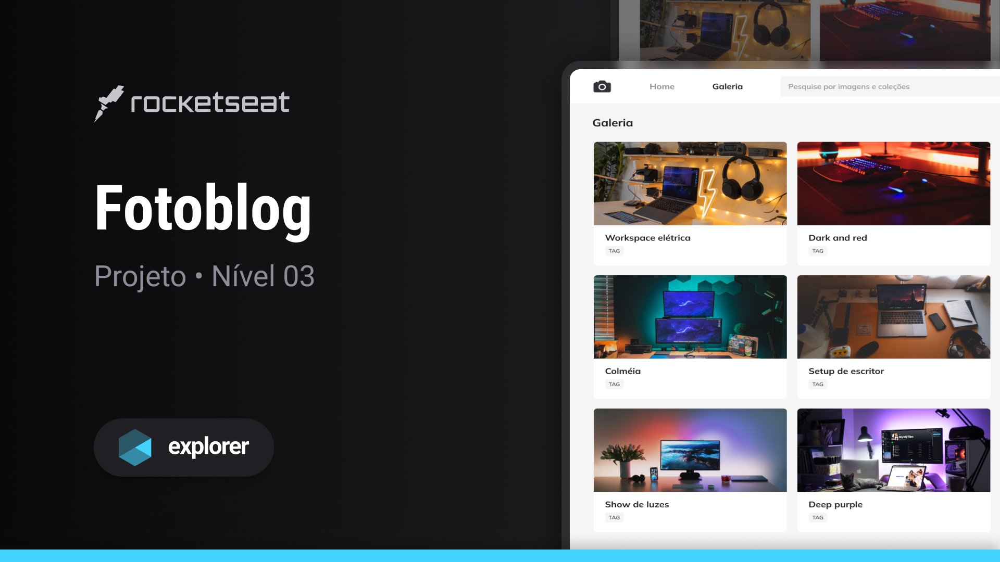

  

   
   

  

    <a href="#-projeto">Projeto</a>&nbsp;&nbsp;&nbsp;|&nbsp;&nbsp;&nbsp;
    <a href="#-tecnologias">Tecnologias</a>&nbsp;&nbsp;&nbsp;|&nbsp;&nbsp;&nbsp;
    <a href="#-layout">Layout</a>&nbsp;&nbsp;&nbsp;|&nbsp;&nbsp;&nbsp;
    <a href="#-contato">Contato</a>
  

  
  

## Sobre o projeto

Este projeto consiste em uma interface web simples, construída como parte da trilha Explorer oferecida pela Rocketseat.
O objetivo principal é abordar conceitos fundamentais de grid. Durante as aulas, foram aplicados os seguintes conceitos:

Conceitos aplicados
* Conceitos e demonstração prática dos fundamentos do CSS Grid no código
* Propriedade `grid-template-columns`
* Propriedade `grid-template-rows`
* Propriedade `grid-column`
* Propriedade `grid-rows`
* Propriedade `grid-template-areas`
* Utilização do shorthand para simplificar a definição do template do grid

## Tecnologias
- HTML
- CSS
- Figma

## Layout do projeto
<table>
  <tr>
    <td></td>
  </tr>   
</table>

## Demonstração
Aqui está uma prévia do resultado final do projeto desenvolvido
[Link Demonstração](https://joao-sillva.github.io/fotoblog/)

## Desafio
A partir deste projeto, foi proposto um desafio recriar o layout utilizando os mesmos conceitos aplicados,
porém com uma temática diferente. Você pode encontrar mais detalhes do desafio clicando 
[blog-de-gatos](https://github.com/joao-sillva/blog-de-gatos).

## Contato
Se você tiver alguma dúvida ou quiser entrar em contato, você pode me enviar uma mensagem pelo
[LinkedIn](https://www.linkedin.com/in/joao-sillva/).

(<a href="#readme-top">voltar ao topo</a>)
